# **Milestone Project 2**  - Interactive Frontend Development. 

## 🎵 **Hydrasound - Explorer** - _Find your music professional_

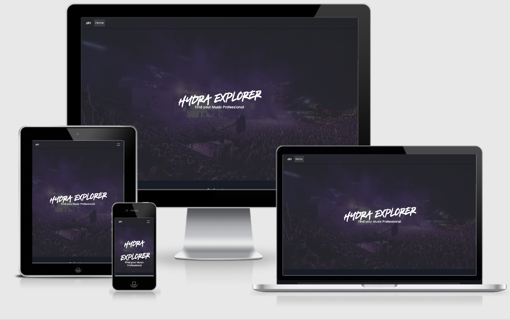

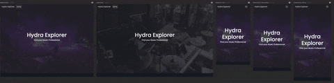
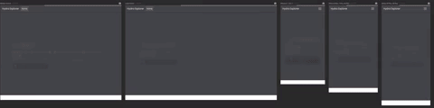

visit the deployed website here: ****[Hydrasound Explorer deployed on Github Pages](https://danielboots.github.io/HydraExplorer/):**


--
## 📓 **About the project:**

**Hydrasound Explorer** HydraExplorer is the start of an application i have been wanting to build for a while, where it will allow users to find Hydrasound members with the particular skills they are looking for. 
For example a user can search for Remixers or music consultantcy services and our application will return the relevant results. The results are then associated with their own user page for further infomation and contact details.
I decided to approach the web app using the front end DOM manipulation skills and frameworks i have learned so far from the code institute full stack course. Primarily Javascript and Jquery amonst other technologies.

I aim to build the web application following web best practices and also to fulfill my need to present user information on the application  which is not only well structured but is also mobile responsive. 

It should have a a professional look about it and also is not overly complicated with regards to UX, navigation and content layout so that potential clients can visit the website and find what they are looking for quickly and easily.


## 💻️ **Technologies Used:**
___

* **[HTML](https://developer.mozilla.org/en-US/docs/Web/HTML):** - Is the main language used in this project which allowed me to correctly structure the website, whereby using best practices to use semantic tags where appropriate.

* **[CSS](https://developer.mozilla.org/en-US/docs/Web/CSS):** - Was used via an external stylesheet using best practices to style format and visually present the HTML.

* **[JAVASCRIPT](https://developer.mozilla.org/en-US/docs/Web/JavaScript):** - *As part of Bootstrap* Javascript although i havent programmed it, was included in the site as part of the Bootstrap framework so that some Bootstrap components such as the navigation toggler would work.

* **[JQUERY](https://jquery.com/):** - *Extensive parts of the web application are programmed in Jquery, click event listeners on page loads and loading of the users data all employ the use of JQuery.*

* **[BOOTSTRAP](https://getbootstrap.com/):** - The framework for the site allowing use of the Bootstrap grid and responsive mobile first approach. I Used many components from Bootstrap mainly, the Carousel, Nav bar, forms and modals. 
* **[MDBOOTSTRAP](https://mdbootstrap.com/):** - The framework based on Google Material Design for Bootstrap. 

* **[HANDLEBARS.JS](https://handlebarsjs.com/):** - Handlebars allowed me to template out the user cards on the front page from JSON data. It worked by iterating over the JSON users data and running its templating functionality to provide me with the boostrap cards for users which i needed. Reasoning for this instead of hard coding was ease of use, to add a new user i just add the new user to the JSON data and the templating is handled for me.

* **[GOOGLE MAPS](https://developers.google.com/maps/documentation):** - I used the Google Maps API in order to add in user data to the map providing a visual representation to users of where the 'professional musician' is based.

* **[GITPOD](https://gitpod.io/):** - IDE for this project. Allowed me to fork the Code Institute template from Github and open in Gitpod so that all extenstions were available.

* **[GIT](https://git-scm.com/):** Git employed as version control

* **[GITHUB](https://github.com/):** - Github was used to host the repository for this project.

* **[SQUOOSH](https://squoosh.app/):** - I used Squoosh in order to reduce the image sizes

* **[PHOTOSHOP](https://www.adobe.com/uk/products/photoshop.html):** - For editing images associated with this project.

* **[BALSAMIQ](https://balsamiq.com/):** - Mac version to develop wireframes for this project.

* **[CHROME](https://www.google.com/intl/en_uk/chrome/):** - Not only did i use Chrome extensively for testing and bug fixing but I used the following extensions :

* **[PESTICIDE](https://www.google.com):** -  This extension inserts (with auto reload) the Pesticide CSS into the current page, outlining each element. - Giving a good visual representation of containers rows etc, as i was using material design from MDBootstrap i was inserting containers in to containers in points to get the desired layout and style, this extension allowed me to view the layout correctly. 
* **[JSON VIEWER AWESOME](https://chrome.google.com/webstore/detail/json-viewer-pro/eifflpmocdbdmepbjaopkkhbfmdgijcc):** - A extension to visualise JSON response in awesome Tree and Chart view, helped me with writing jQuery with regards to how to access the correct JSON values.
* **[RESPONSIVE VIEWER](https://chrome.google.com/webstore/detail/responsive-viewer/inmopeiepgfljkpkidclfgbgbmfcennb):** -  An excellent extension suggested to me by my Mentor Allen - A Chrome extension to show multiple screens in one view. the extension will help front-end developers to test multiple screens while developing responsive websites/applications.
* **[GIFY](https://giphy.com/):** - Used to create the .gif file in readme depicting the responsive viewer in action and showing my testing on different screen sizes. 

* **[WEB FONT GENERATOR](https://www.fontsquirrel.com/tools/webfont-generator):** - Used to bring in a custom font i wanted to use for the main H1/ H2 sections, custom branding.


___


## 🧑‍🎨 **UX:** **User Experience Design (UX)**
 ___
Developed from the code institute full stack web developer module on UX design.

**What is UX:**

User Experience Design is the work, processes and skillsets involved in creating useful useable products which provide value not only to the customer but the business owner ensuring that a product not only works but is intuitive, simple, and enjoyable to use.. A good UX experience is achieved by following a defined process called User Centred Design or UCD for short.

I haven chosen to recreate a feature from my current business following best practice UX principals and will apply them to reassess the current needs and wants of my customers and future potential clients.

I felt like tackling a business which I am currently involved in would give me a better understanding of implementing UX principals which will then allow me to generate better UX designs in the future with a stronger understanding of the core principals.

I will aim to cover the different planes in detail so that this document can be used as a blueprint for future UX development I undertake.


## 💡 **Strategy plane: The Initial idea.**
___
The basis behind the HydraExplorer idea, was to start a web app which allows users to search for music service, be it a music producer or remixer, consultancy etc. In a very easy and intuitive and visual was regarding UX. My primary aim was to bring together many of the technologies i have learned so far to then use these technologies and display data in a comprehensive way. I aim to bring in user data using JSON and AJAX so that my web app has the ability to expand and grow with ease as users can and will eventually allow themselves to register and upload their own data to the app. For this initial app, i will hard code the JSON data but provide extensive evidence of my knowledge of templating JSON and AJAX to satisfy the assesment criteria. 

The web app, should, display musician data in a clear and unclutted manner,for best UX and also allow the user of the web app to find the correct user by service with extreme ease. I will acomplish this by the use of jQuery to provide hide effects and also to change hero sections based on user selections. 

Regarding the website, my current business website  currently residing at https://hydrasound.com is currently deployed using the Wordpress CMS platform, with a front end page builder called Elementor.

However I felt that I could overhaul and run a full UX analysis on the site in order to improve the user experience, through page speed ( I found that Wordpress once you start loading multiple plugins the website becomes slow and has a tendency to need frequent updating and maintenance.) improved navigation and to better display appropriate content to display what my site offers for potential clients.


## **About the business:**

The business is entirely online and is concerned with music production services provided by musicians who can add their details to the Hydra Database (for now this is hard coded in JSON format). From Mixing, mastering, track production, consulting etc with the primary aim of the website to display that information and get the potential client to contact users directly using the forms provided on their individual users page to discuss their needs further.

**Strategy to deliver above.**

* A clear and simple design starting with the Hero section displaying the Name and tag line to establish the message of the site.
* 	Landing page explains through a text box About the site in the first section.
* 	First section offers users a button selector using jQuery to fade out inappropriate results
* 	A clear selection of user cards, displaying their main credentials
* 	Addition of a Call to action within the user card in order to view that individuals complete profile.

**Branding:**
I own the domain name https://hydrasound.com and my business name follows suit with the strap line HydraExplorer – Find your music professional
I don't have a logo as present for the HydraExplorer and wish to be represented as serious and professional.

**Strategy to deliver above.**
All of the below points should fulfil 'user first impressions' (see table below) and is especially importance in our B2C business.

*	Develop a logo – which is simple but effective, as full txt for a nav bar section may be too long. Logo will also act as a link back to the home page as common practice. *credibility and trustworthiness.
*	Develop a professional colour scheme – check out competitors in not only music but business-related websites. Use consistently throughout site.
*	Choose a font type for the project which reflects what we are trying to achieve – research music platforms and use similar fonts. Spotify similar fonts -two come to mind straight away. “Montserrat” and “Poppins” Use consistently throughout site. HydraExplorer will employ ‘Poppins font’

*	Utilise the bootstrap card deck to display the users in a professional and easy to ‘learn’ manner.
*	Develop a footer with info section and contact details on the main index.html. Footers will be autogenerated on the Users.html to provide relevant information about the artist/ user specific page.

| User first impressions        | How to achieve          |
| ------------- |:-------------:|
| **_Does it look credible and trustworthy?_**  | Yes – through colour palette, fonts,  testimonials, social proof and displays of current work. |
| **_Does it offer what I want?_**  | Yes – Clear display of services related to and relevant to the music industry. |
| **_Does it look valuable enough for me to stay?_**  | .Professional design, clear and simple navigation, displayed is an easy to read manner. Mobile responsive. |
| **_Does it look valuable enough for me to return?_**  | YNo hard sell but only offering our users profiles / services |
| **_What actions can I take now?_**  | A clear Call to action labelled 'Contact me' on the user profiles, allowing user to fill in a form to request to work with the desired user. |
| **_How do I learn more?_**  | A clear Call to action labelled 'Profile and all internal links go to appropriate content and user page for the correct service required. |
| **_How do I contact someone?_**  | Footer provides direct contact details for the webmaster. User profiles all contain a web form to contact the site and request to work with a user with clear CTA under their name in the hero section of their user profile. |


**What is culturally appropriate**
In relation to this project I have found that the brand name stands for a lot right from the offset. Our website is only concerned with displaying user specific services within the music industry 
We keep the site strictly about musical endeavour and focus solely on providing the users landing pages to provide evidence of their work and expertise.
I have also developed the site to be mobile first as our demographic for clients looking for our services seems to be in the  male category and age range of 22-34, whereby we know its highly likely that users have access to a smart phone and will be accessing our website from mobile.

**Tracking and cataloguing content in an intuitive way.**

Regarding the display of the content I have opted for a typical section style layout to the site, this meaning I have a hero section and subsequent blocks of content each separated by alternating background colours, an off white and white to ensure content separation is apparent. I have also provided in this a toggler button using jQuery to enable a dark mode, so that users can optionally switch to a mode which makes the user cards stand out even more when a service button is selected.

Typically in modern web design a hero section is employed so I have taken advantage of that with a centered H1 and H2 Heading for site title and strap line, using a more bolded font to make an impact from first page load. This screams to the user, this is the site title and this is what you can do here.
I also used a background image which is relevant (musically) to display the field the website is addressing. One concern is the bright image was taking away from the Hero text, so a background overlay was used in order to fix this. Not only that but the background overlay is the main colour in the colour palette chosen again adding to our branding and overall UX experience for the potential client.

**What is the importance of this.**

From the first time the user visits the website we want to display a level of professionalism and ease of use, not only that our strap lines, branding and colour palettes are correct but our content is distraction free and displayed easily enough that a user can learn about our website and feel at ease very quickly. Becoming instantly trustworthy is a primary focus and puts the potential client at ease when considering they could spent a lot of money with us after they make contact.
Not only that but to display top level clientele and labels we work with it also allows the client to visualise the level we work at and increases our trustworthiness. This is important when working remotely knowing that a level of professionalism is maintained and that results are delivered. Clients should feel like we are delivering around the clock, from our online presence, how the website works, looks feels and our displays of current work. This should all work cohesively in order allow the client to feel like they are making an informed choice.

**Why would a user want this.**
Music production services are expensive for those who don't wish to learn the profession themselves, although a lot of websites may offer services, it should be noted that there is no quality assurance in the industry. It mainly works on word of mouth, professionalism and who our current clients are. It is important that our website portrays all of these factors so that a new client feels comfortable enough to use the CTA form on the user specific pages to approach us with confidence knowing they will get a professional level of service from start to finish. Not only that but providing direct contact details of the webmaster on the footer section also allows me to deal with and enquiries or questions the user may have.

Once a client makes contact it is often that we get repeat business from them so to display an array of services on the site all presented correctly will allow the client to return to our site time again find the service they require, make contact easily and book our users again.
This was an important part in the planning of the website, how to template the user cards and assign a user id to allow for the easy addition of more users to the database in the future. 

**What creates a good User Experience with regard to this online Music production service finder business.**

*	Strong branding – colour palette – typical industry typography.
*	Seeing relevant previous work. - the user specific page achieves this, by displaying spotify top tracks, biography gallery etc.
*	Meeting the person they are going to be working with virtually, the user page provides all relevant data.
*	Social proof – social media presence, all users social links displayed under bio.
*	Call to actions with complimentary advice or request phone call to discuss needs.
*	Means in which to contact the website or myself across timezones and countries.

**What does the user / client expect?**

*	Strong Branding- Does this website come across as an authority in its field. I feel we do by the use of correctly structured content, branding through colour and font type and also consistency throughout.
*	Pricing – this is often not displayed for contracted work on the website so enquiring for more information is often accepted for this B2C business, I am aware that this is often employed with B2B however each clients project needs are different and each project budget is discussed on an individual basis. This also prevents competitors from under pricing and also gives the business owner the opportunity to explain costs associated with the service the client is enquiring about.
*	Does the business offer the services which I am looking for? - Music production, remixing etc, does it fit my needs in terms of style and genre.
*	Does the site have evidence of previous work I can listen to and make an informed decision. - It does from spotify top tracks, biography and Youtube, further development of the website will include a dedicated section for previous work displayed in a portfolio.
*	Ease of use and contractible -multiple CTA and quick forms available on each page with social media accounts displayed below the user biography, Maps with correct addresses of the users for increased assurance.


**Prioritisation – To launch a Minimal Viable Product.**

We can address which features should be prioritised primarily by developing a map of importance and viability/ feasibility.
For this submission we will be focusing on UX efforts of higher importance and developing features of lower importance and viability/feasibility further in the timeline of this project.


| Opportunity/Problem       | Importance         | Viability  |
| ------------- |:-------------:| -----:|
| **_A.     Increase user conversions through CTA on user profiles_**       | 5 | 5 |
| **_B.     Previous work showcase_**      | 4      |   5 |
| **_C.     Increase social media followers_** | 2      |    4 |
| **_D.     Addition of social networking features such as instant messaging etc_** | 5      |    1 |
| **_E.     Creating a user backend to manage work requests / ie: user dashboard_** | 4      |    1 |


**Graph of importance in order to launch our MVP from previous table.**

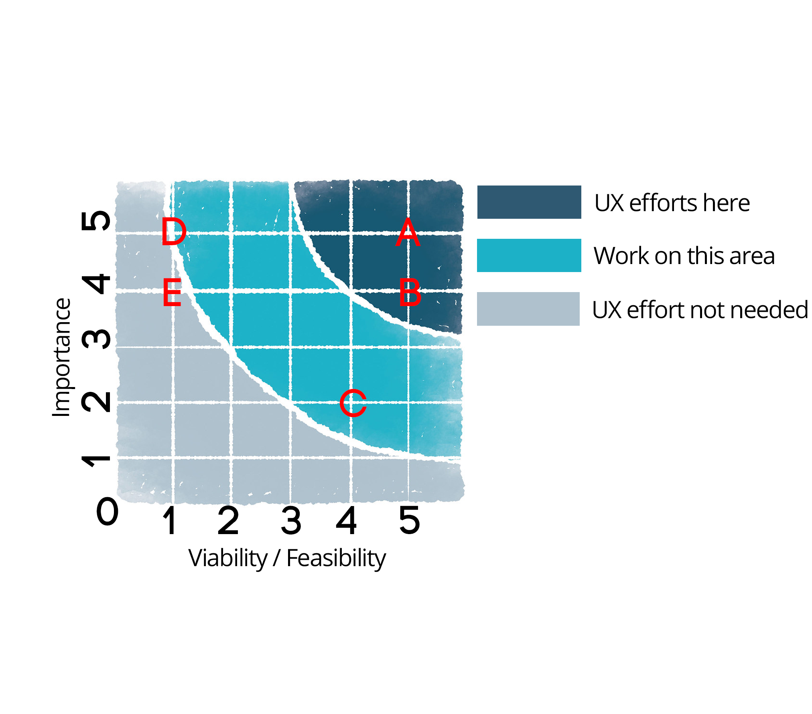


As i aim to build upon the initial features of this web app i suggest the following strategy in order to allow the web app to grow exponentially without the need for excess page creation.
I am using templating from Handlebars and jQuery to pull in JSON data on a hard coded template page, this will pull in all data related to the user and display it on their very own user page, with their id number. This furthermore allows me to just hard code one page Users.html and not create pages for each individual musician.

## 🧰 **Scope Plane - requirements and functional specifcation**
___
### **What users and stakeholders - Say they need**

* The user visiting this type of website wants a professional website easy to navigate and also find the music professioanl they are looking for, with links to more information and examples of their work, this can be provided through a number of means, for example Spotify, Youtube, Biography  / discog etc.

### **What users and stakeholders - Actually need**
They need a clean and tidy designed website which is mobile responsive, highlighting previous work, the music producer who will be working for them and a list of previous clients and labels who we as the business owners can get them in touch with. They need a site that gives them information based on what they are searching for. So a prioritised section of the website for said services, additional information on the services and an opportunity to discuss the project with a real life person over the phone or on email.

### **What users and stakeholders - Don't know they need.**

* As a working business website, we have to abide by GDPR rules, so a pop up advising the client on our privacy and how we use their information would be needed down the production line. This production app will not have this in place but will be if deployed.

* A merchandise store – an opportunity to increase revenue as a more B2C standard practice. 

* Other desirable features may include, online reviews, more services for music promotion and education through a LMS or one to one coaching. 
* A system to which users can add their own details through registration. These services would beneft not only the user but the business owner as he can monetise these features whilst ofering more services to the client, monetisation may be through allowing user registration for a monthly subscription fee. 

* Social networking feature – not essential but desirable, perhaps a twitter/facebook like entity where users can register to the site share their music tips and advice, this would allow for content to be shared cross platform and to other social media accounts, drastically increasing awareness of our web application.

* An iOS and android app – its true that many users now if these features down the line are implemented that developing an application would be of extreme beneft, it would allow extra monetisation brand awareness and next level professionalism, as far as I am aware there are no such apps with the previous aforementioned features bundled into one. This could be an avenue to explore in the future. I have been exploring this avenue with my mentor Allen and he has suggested that in the future it would be wise if this approach were to be undertaken that it would / should be produced using Dart and Flutter from Google, Reasoning behind this is that i would only be looking at maintaining one code base for the web application iOS and Android applications.


## 🏗️ **Structure: How we present information:**
___

The web application will consist of a typical navigation and structure which will conform to web best practices. By this we would expect the navigation menu items to be located to the top right hand corner of the web app. To the left we will employ a Navigation bar logo which doubles as a main Home or index.html link.
As it stands there will only be 2 pages, this is because i have employed a templating style method to my workflow and web application, end point url for users will be USERS.HTML and an associated user ID. This implementation was chosen as i dont have to create new pages per user, i am gathering all data from a JSON file for my users (which in time users will be able to register their own detail) this process allows my website to grow exponentially (with users) without creating multiple individual pages.

The menu items are only one level consisting of a linear structure, so no nested pages as of yet. The structure is as follows.

#### **HOME---USERS:** 
* For this web app, the home page is employed, users.html wont be available on the nav bar but the users.html is a templated page. An extended menu version may be by separating data off into categories such as 'Remixers, Producers etc' however as my database of users only consists of 6 people i deemed it unessessary at this moment in time.  

### **Information on structure regarding page layout and design.:**
 The general structure of pages will consist of a nav bar, a hero section and then relative content to that page, structured using the projects fonts, font sizing and colour palette.
* As discussed earlier I have opted for a content block approach which will allow me to display content in a clean and structured manner. These two points allow the user to learn the layout and feel of the website quickly.
* Each page will have working navigation whereby the text HYDRAEXPLORER will return the user to the home or landing page.

* The home page will have the Handlebars templating library employed so that it can generate the user cards needed. Speaking with my mentor it was deemed that the user cards be generated above the map section for a better UX experience.


* The footer consists of two sections positioned centrally and away from the edges of the site so that any information can be viewed with out scanning from left to right on larger screen resolutions. I discovered this as I work on a 27inch iMac and having content full width at this size is bad for UX in my personal experience.
Regarding the footer, section one or block one will have an information box
section the second will offer my own contact details.

* Users.html will be a hard coded template page which pulls in **JSON** data using **AJAX**, this will allow me to create one hard coded page which using javascript allows me to display the correct user data for the selected page. 

* A working example of the above would mean that when a user selects the option for a consultancy agency the options **HYDRASOUND** and **EDDIE GORDON** are highlighted. If the user selects Hydrasound, then i have coded that option to have an id of 1. When clicking, data is poipulated in the USERS.HTML to show JSON data from the user with the id of 1. This id is grabbed from the URL using Javascript code in the main.js file. The code to achieve this is below. 

**Copied directly from this video (as couldnt find the referenced stackoverflow code):**

https://youtu.be/qoN6-rWIYrk?t=376 - timestamped at time for code.

``` javascript

function getParameterByName(name, url) {
    if (!url) url = window.location.href;
    name = name.replace(/[\[\]]/g, "\\$&");
    let regex = new RegExp("[?&]" + name + "(=([^&#]*)|&|#|$)");
    results = regex.exec(url);
    if (!results) return null;
    if (!results) return '';
    return decodeURIComponent(results[2].replace(/\+/g, " "));
}

let userId = getParameterByName('id');

```
* The users.html page in particular employs a contact me button using an #ID scroll function so that potential clients can quickly get to the contact me form without having to scroll through the full user page. This will become more important for UX when more user detail is added, for example reviews, ratings etc.


### **IXD:**

Hero section is not full viewport height it uses the CSS style  `height: 95vh;` with next sections always visible, this promotes scrolling and intrigue.
* Colours fonts and structure are reused throughout the site.
* I did however add an animation class from Animista which was used throughout the site on the hero text and strap line,
it plays once on page load and is a fade animation, which I feel adds a subtle but impressive introduction when visiting pages. No further animations are employed.


## ✏️ **Skeleton Plane – Interface design, navigation design and giving form to function:**
___

* As with every project which is to be taken in to production it was essential to frstly wireframe the project. This would allow me to test out diferent ideas layouts, navigation and presentation which is expected when visiting this type of website. I developed the wireframes using the Balsamiq software which allowed me to produce low fdelity mockups of the fnished web application without the need for coding it frst. This saves on production time and allows us to have a 'map' of how to fnally code the app.
Please note – these wireframes may difer slightly from the end result


#### **Index Page - Wireframe **
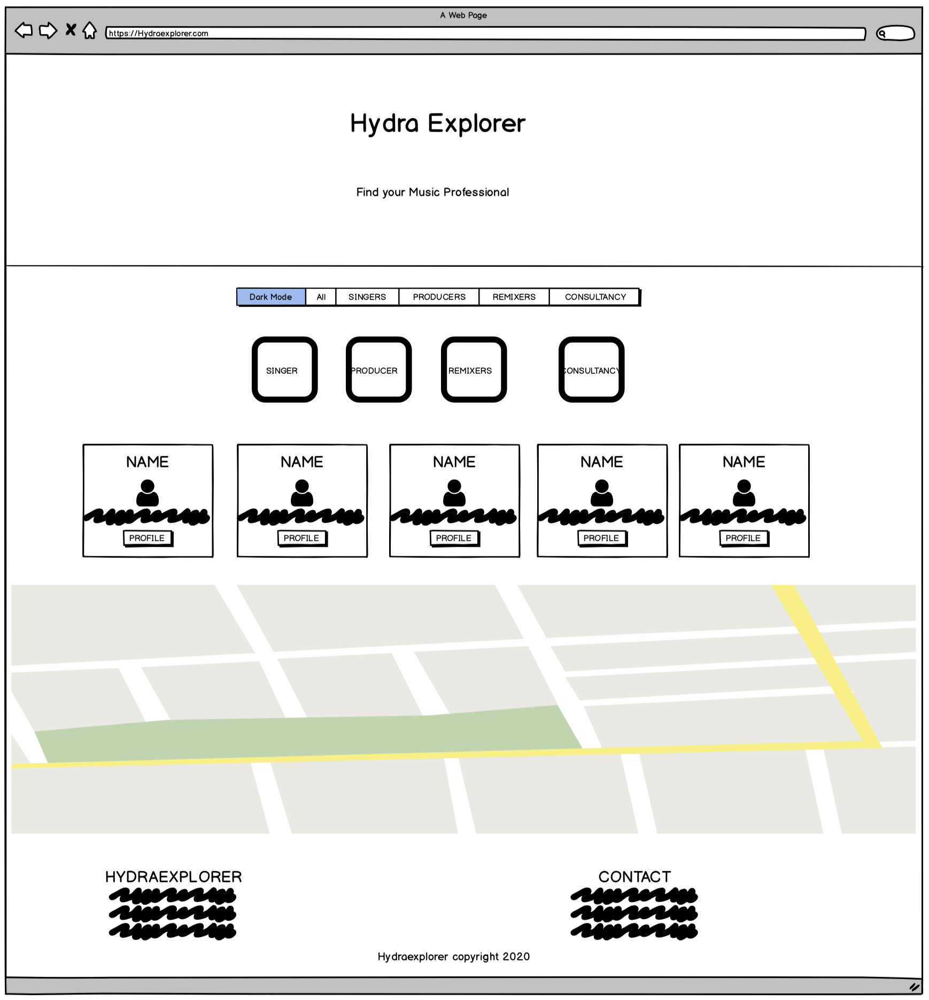


#### **USERS - Wireframe **
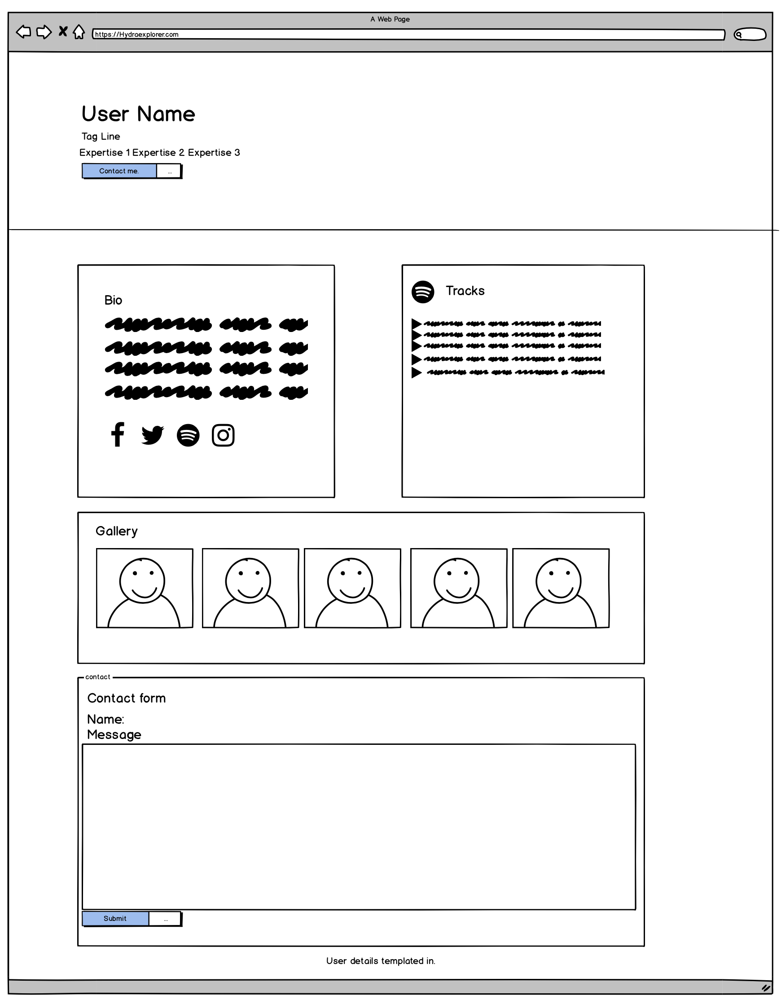


### **Skeleton plane cont:**

In this project we are only focusing on data presented and data in motion through the use of AJAX and JSON, i. also use JSON to populate data from **Spotify** in the form of a users top tracks.  


The data presented should provide good usability and at current is only concerned with a few features, contacting through CTA and presenting the information using tools such as user cards and presenting data in blocks. As there are very few features and a sole aim at contacting through the site this should alleviate cognitive overload from the end user. This is acheived by presenting the contact form on the user page only and not on the index.html page.

Navigation has been assembled in order of priority from left to right and all links and internal links are well displayed (many as buttons) and working.

Furthermore I found no need for pagination to display data and also provided menu items and buttons with relevant font awesome icons to aid in web application learning to the end user. Data is presented the same throughout the web app alongside colours, fonts and branding all aiming to allow the end user to learn the web app easily and enjoy using it.

### 🚀 **Surface plane:**

Using all the planes above and the data presentation and all the research carried out I was able to present all of this with my project.
I hope you enjoy browsing my web app and I look forward to developing it further.
In ending this UXD analysis and a quote I feel summarises this whole process I will leave you with this.

> “ Good UX smells like value. Ask yourself the question whenever you're building a project, does this smell like value?”

Brian O'Grady - Code Institute


## 📦️ **Features:** 
add features: 
* The web app is totally mobile responsive with a collapsible toggler navigation. 

* The site has features such as Youtube and Spotify embeded into it, pulled in through JSON data.
* I used interchangable parallax style Hero and separator sections for modern display of content.

* Hero sections change on service section mouse over.
* jQuery animations used to fade out irrelevant options as selected by the user, Button click events allow this. 

* The Logo position left always takes the user back to the Home page.
* Google Maps used so that users can see the users location. This is using an API from Google and programmed in javascript. 
* Social media icons are active and link to relative external platforms using data from JSON to change the href attributes on the users.html pages for each user.
* Expected use of font awesome icons to assist in users learning of the site.

* Use of animation for hero text - minimal use of animation but effective for a pleasureable experience on page load.

* Footer features on Index.html with infomation section describing the service, and a direct contact section populated with my personal infomation. 

* Users utliizes bootstrap cards which display image and content relevant to the user is looking for, regarding their specific areas of expertise. This was furthermore templated using the Handlebars.js library. This allowed the developer to create one template card which was used to create all the data cards for the users.

* Templating using Handlebars must get a specific mention as this allowed me to realise this project from the beginning, by templating the user cards and pulling in the JSON data especially assigning user ID's i was then able to link the templated user card to a user.html page specific for that ID. 
using the templated page i then used the jQuery library to populate the user specific page using data specific from JSON.(Which im proud of achieving).

* As i produced the first version of the site, i thought it may be good to employ the use of a dark mode toggle function. This dark mode uses Dark mode CSS to change the background of the white containers to my branded grey slate colour. I found this useful for UX as especially with jQuery fade features it really stood out presenting the data far better. 
* in addition to dark mode i added a local storage feature to the dark mode so even on page refresh dark mode is still active if it was previous, this will also be indicated with the dark mode toggle button, when active the button is highlighted in a green 'On' status. 

### **_Code Refactoring_:** 
___
In this project i also used the extension to Gitpod called prettier which would format my code, however i then went through each page 
and ensured there were no excess lines of whitespace. I also chose a uniformed way of commenting display, whereby i left a line gap either side of my comments so that people can distinguish between code blocks. I feel it was just a neat way to format my comments. 


## 🧪 **Testing:**
___

Testing was an integral part of the design and build process, responsiveness is cruicial to the success of any online website so a number of steps were employed to ensure that the site worked across a number of platforms and browsers.
Not only responsiveness but positioning, colours, inheritence etc were all factors to be taken into consideration, thus Google Chrome developer tools was used extensively to test all aspects of the site.
Although Bootstrap is a mobile first approach i opted to work on a simple desktop version first as i could work backwards.
I first of all set up a few .css rules for the body section which allowed me to set some global rules such as.

<!-- Code Blocks -->
``` Css
  * {
  box-sizing: border-box;
}
```
Which made sure that i was working with the box model more logical. 

One other major factor i came across is when using `.container-fluid` my content was as expected at full width across the screen, which for some sections i liked but on bigger screen resolutions i found for UX purposes i needed to set a max width so that the content didnt spread across the page. I found this looked sloppy and not good in terms of design. I tested this too out with dev tools to create a `.container-max` rule which for large screen resolutions the content was displayed better.
Resulting in: 

``` css
/* container to pull in content on non full width containers */

.container-max {
  margin-left: auto;
  margin-right: auto;
  max-width: 1400px;
  padding: 15px;
}

```

Furthemore i implemented a media query after using the Repsonsive Viewer extension for chrome and it was evident that the hero txt on smaller screen resolutions such as iphone 6-7 it felt like the hero txt was too low in comparison with other screen sizes i used this code to rectify the problem and images below show a before and after comparison of a better looking UX 

```css
/* media query from chrome - addition of this media query to line up hero text better on smaller screen sizes. */

@media all and (max-width: 425px) {
    .hero-text h1 {
    font-size: 90px;
}

/* media query from chrome */
 
   .hero-text {
    text-align: center;
    position: absolute;
    top: 30%;
    left: 10%;
    right: 10%;
    color: white;
}

```
### **Before:**

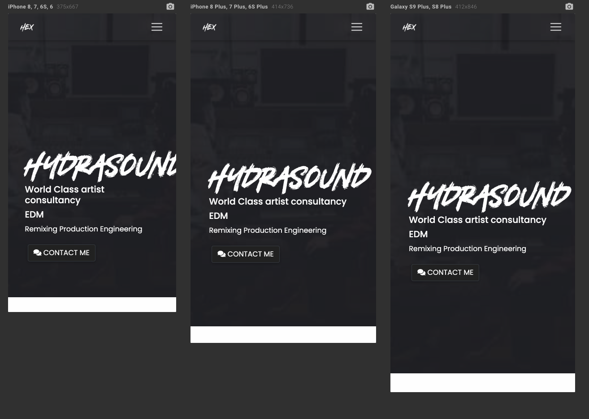
### **After Examples:**

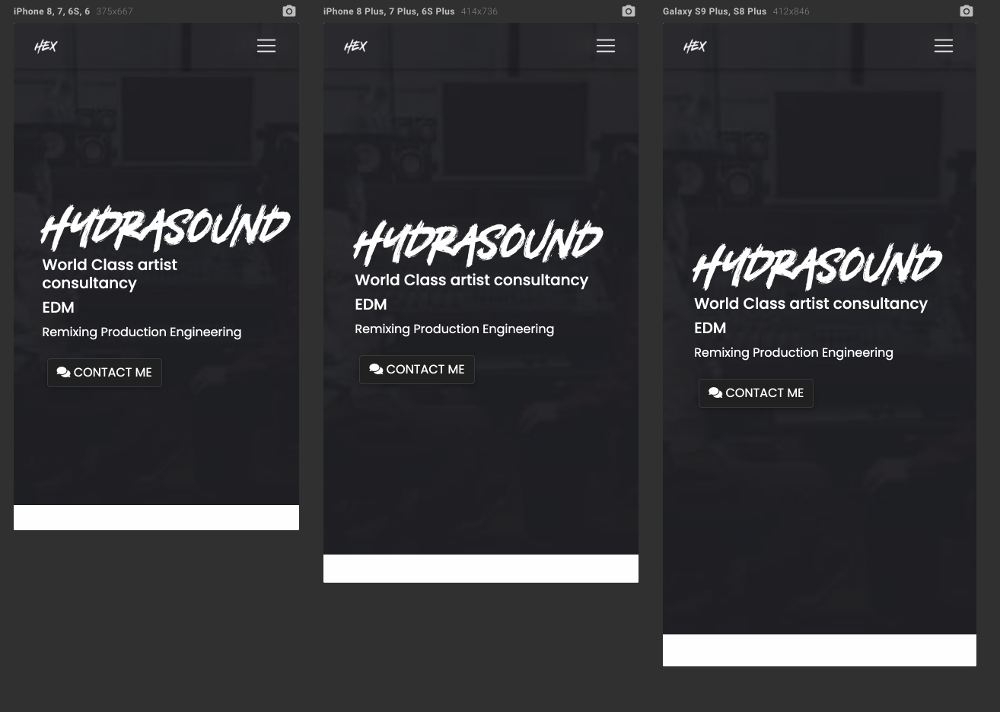
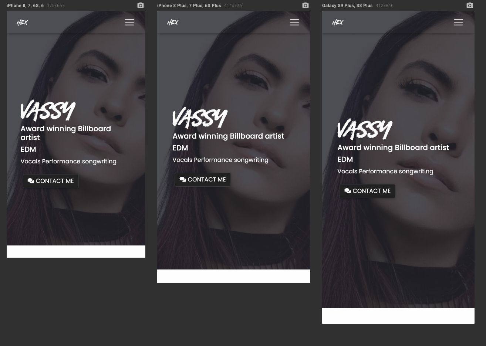


## 🧪 **User Experience testing:**

As this website is aimed at getting clients to interact with the site through contacting a 'musician' i had to ensure that in my testing i adequately tested the UX and that it was simple enough for the user to "learn" how to use the site and follow industry standards and user expectations.

This translated in to me using a top menu bar with LOGO positioned to the left as expected.
For this website i havent provided an extensive menu option as i want users to use the button selectors under the hero section to find the correct musician service.

I used many inbound links and tested all links ensuring that they all work and link correctly, this had to be tested on each individual user as all data is being populated from the uses.json file. So although i only have an index and users.html the users.html can potentially display hundreds of thousands of users. So efficent use of testing is employed here.

* Furthermore to this testing method this project taught me the importance of **Console.log()** as i used this for every piece of code and testing i used, i found that i could deep dive into my javascript and jQuery code and work out alot of how to display data by testing logs in the console. For this application i have left alot of my console logs active in the code, if you would like to explore what logs i am using, feel free to use the developer tools to display the data. 

I have also taken the liberty of providing an example of my logs for users.html below. 


* All social media icons on users.html link to the right external pages using the target="_blank" attribute so that external pages are opened in a new tab.
I tested all parts of the website including Bootstrap components, as i used:

* Bootstrap cards - tested on all responsiveness screen sizes and operating systems.

**User Experience: from top to bottom testing each feature for bugs**

**index.html testing**
* Home Button always returns user to index.html
* HE Logo always returns user to index.html
* Dark mode toggles dark mode on and off, green highlight button works, also logs status to console.
* Refreshing the page and navigating away, opening a new tab and retrieving page again using localstorage Dark mode status remembered.
*  All button returns all card selectors to inital state.
* Singers button displays only users with singer class.
* Producers button displays only users with producer class.
* Remixers button displays only users with remixer class.
* Consultancy button displays only users with consultant class.
* Hovering over 'singer' 'producer' 'remixers' and 'consultancy' block images changes Hero image to appropriate background image.
* Handlebars.js - iterates over JSON data and displays correct data and all users displayed without error. 
* Card templating, returns all users in JSON object 'users'
* Card templating displays correct information for all users: Name, type, genre, location, country and tags.
* Card templating profile button assigns correct user ID for all users
* Map displays locations and links to all users correctly, clicking a marker displays user location and a link to the correct url.
* Footer displays correct information.

**users.html testing**
* success from server loading users.json as from console.log
* console logs report data being recieved for correct user each page
* console logs return correct user id from URL and checks for class user-details.
* Correct user id appended to the user.html for example https://danielboots.github.io/HydraExplorer/users.html?id=0 returns Dan Thomas and all relevant data from JSON for that user.
* Correct hero image displayed with overlay and parallax working.
* JSON data for User name displays correct information.
* JSON data for Tag Line displays correct information.
* JSON data for Genre displays correct information.
* JSON data for Tags displays correct information.
* Contact me button ID scrolls to correct position (Contact request form)
* JSON data for Biography displays correct information.
* JSON data for Social media buttons displays correct clickable links which open in a new window.
* JSON data for Spotify top tracks data displays spotify embed correctly.
* JSON data for Youtube embed displays Youtube video to the container correctly.
* JSON data for Gallery  data displays all images from array correctly, with placeholder image if no gallery link supplied as per the template.
* EmailJS contact form works, tested a number of times from each user page.
* Copyright / footer data pulled from JSON displays correct.


### **Utilising Mentor and tutor Sessions:**

After my initial mentor session to discuss the idea and scope of the project i made sure that i could bring the project as far to completion as possible so that i could use his expertise in our next session. 

* The second meeting Allen did advise me to change the layout of my project so that the map recided below the user generated card templating. 
* He also fixed a bug in the social media link buttons which was bugging me for a while, however it was a simple error where i had left the # in the id of the button, removing that fixed all errors, simple bug but something that had evaded me for a week or so. Further more we added in a `target_blank` to the `href` so those links pulled in from the user.json linked in a different window. 

My third session covered what points i should highlight in my readme.md file. Which included mentioning the Templating function using Handlebars.js the specific code to grab the user id from the url and a few other things. We went over my project folder structure and naming conventions to ensure these were correct before submission,as this was highlighted in my milestone 1 submission. 

He was happy with the level of independence i had shown on this project and we then finalised the check list ensuring all criteria was covered. 

### **Further Testing:**
* The use of validation services for **[Jigsaw CSS Validator](https://jigsaw.w3.org/css-validator/)** and **[HTML Validator](https://validator.w3.org/)** allowed me to modify and fix any errors in my code, 

### **Results from CSS and HTML validation:** 
No errors found, i did use the direct input to the CSS validator service as i am using external frameworks such as Bootstrap and MDBOOTSTRAP which did return some warning errors when using the URL input. However these are out of my control so opting for direct input of my CSS allowed me to test my code only. 

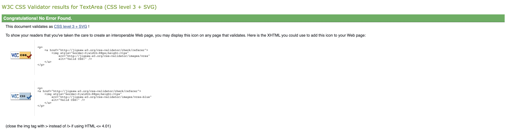

**HTML-Validation**
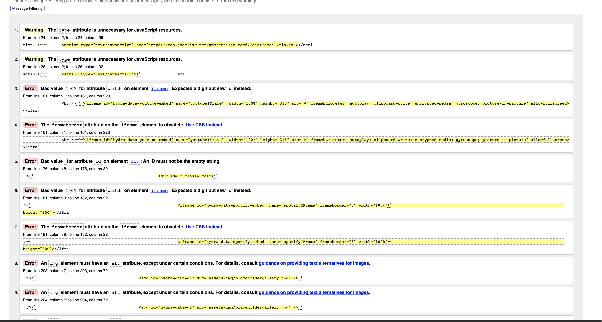

Using these warnings i identified a few changes to be made in order to pass HTML validation, fixing these provided me with the pass, again apart from youtube iFrame embed which i am aware of. 

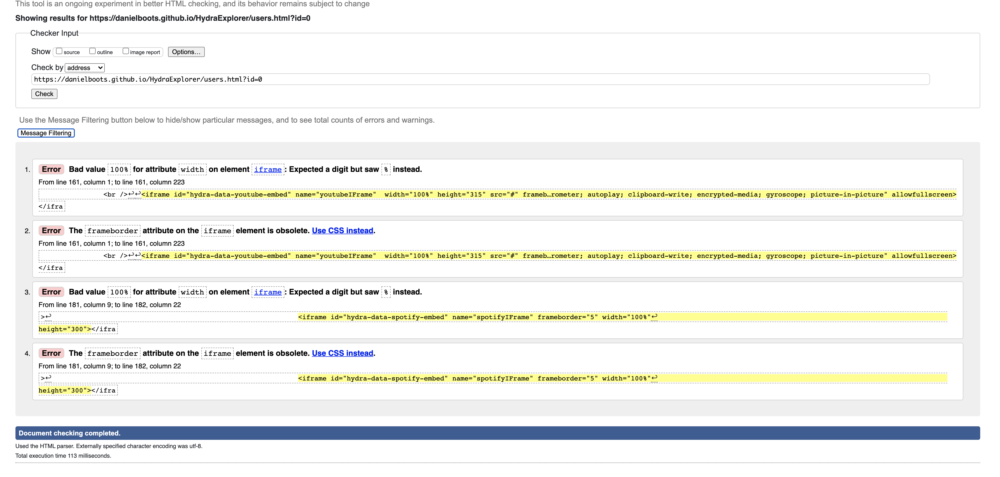

### **Other Testing criteria:**


* I Used the Gitpod built in html testing as seen below which ended up being a great learning tool spotting errors or unclosed ```<.div>``` etc.
I should also add that this tool brought to my attention that as i was using multiple forms on pages that my ID's needed to be unique, an issue which was quickly rectified but easily overlooked. 
what i do like about this tool is that it even tells you what line to look at for the aformentioned error.


* Emmet is also a great testing tool as if you do get errors or unclosed tags it will suggest to you the closing tag to use. I find this very helpful in bug fixing and testing.

* I finally used **[GTMETRIX](https://gtmetrix.com/)** which is used to test page website speeds. All testing came back fine apart from image sizes which scored pretty low. Thus i used the free online **[SQUOOSH](https://squoosh.app/)** to reduce massive image sizes upto 80% of their original file size. This is especially important as large image sizes dramatically increase page loading speeds and leads to a bad UX especially on mobile where heavy loading sites can eat data very quickly. 


### **Testing Issues / known bugs:*

**_HTML Validation error when using Youtube embed._** 

As explained above, i do get an error for youtube embed as the youtube embed uses an iFrame, for this project i am aware of this bug but happy to proceed.

**Dark Mode - Green active state remembered** - this bug is now fixed, however i came across a bug which was simple to fix, it involved the dark mode active (green mode) to indicate dark mode is active. This bug reset the button back to its initial state on page refresh, even if the dark mode from local storage was still enabled. To fix this i copied the below code to the if statement checking for 'if' dark mode is active (Darkmode.js ln 82-85)

```javascript

if (darkMode === "enabled") {
    enableDarkMode();
     //using local storage to test if button class remembered< YES this now works, remembers on state and sets button to green if active
    $("#dark-mode-toggle").removeClass("btn-dark").addClass("dark-btn");
  }

  ```

This when testing fixed the issue of the green dark mode button resetting itsself to its initial state. Now on page refresh, if dark mode is active then the button is also active and green,visually representing the on status, further more the click event listener is still employed so this can then be overidden if the user toggles the dark mode on and off again.


___


## 🏭️ **Deployment:**
This project was developed using the Gitpod IDE which integrates seemlessly with Github, Git pod is a cloud IDE so this allowed me to work at home on my imac or out on my imac using only an internet connection and the website **[GITPOD workspaces](https://gitpod.io/workspaces/).** 

The site was developed inside of the Gitpod IDE and connected to my GitHub repository. 
As sections of the site were completed i ensured that i used version control to maintain copies of my code on the repository. This was achieved via commands on the terminal integrated with Gitpod.

### **Steps in using version control and getting ready for Deployment**

1. `git status` - would give me a list of the files which have been edited and ready for staging.
1. `git add .` - I used this command to add **all** files to the staging area instead of adding each file individually i used the `.` after `Git add` which allowed all files to be added at once, i found this workflow quicker and easier.
1. `git commit -m"Message"` - This is the command to commit the changes and the message allowed me to know what or significant changes had been made.
1. `git push` - Was used to push to the remote repository in this case **GitHub**

When working it was also neccessary to view the changes to the website, for this i mainly used preview, as the save function allowed instant refreshes and updates reflecting my changes. However for fullscreen testing in a separate tab i employed the use of the command `python3 -m http.server"` to open a port on my local machine, instructions were to make the port public then open in browser. 

### **How to clone or run this project natively using HTTPS.**
If you should require to fork or obtain a copy of this website you can follow these instructions. 

1. Visit my Github repo here **[HydraExplorer Repo](https://github.com/danielboots/HydraExplorer):**
1. Click on the GREEN clone or download button, located at the top right of the page see screenshot below.

    

1. Click on the "clipboard" also located on the right now seen as a dropbown box. You can either click the clipboard or the URL, if using URL method remember to right click highlighted URL and copy.
1. Open your IDE and open a new terminal window.
1. Change the directory path to a location in which you want to clone the repo too. 
1. Paste the Git URL and click ok / Clone etc. 


#### **Deploy the site to Github Pages.**
Follow these steps in order to then launch the project using Github pages to be viewed live on the web.

1. Enter the _MPS Repository_ from the Github Dashboard.

    

1. Click on the settings tab.

    

1. Scroll right to the bottom of the page options where you will find the "**GitHub Pages**" Options.

    

From the "Source" option, chose "Master Branch" from the presented options.
The page will refresh and you will receive a notification saying. " _**Your site is published at: [https://danielboots.github.io/HydraExplorer/](https://danielboots.github.io/HydraExplorer/)**_"

___

## 🤝 **Credits Acknowledgements and References.**
___

### **Content**
The content for the website was taken from an old version of https://hydrasound.com my own business website which one of the user search features was in part rebuilt for this project.
So all text and information pertaining to my services is of my own work.

### **Media - images** 
Over the course of my project i used various sources for media - 

* **All other Media images** -  From my own website - which was located at https://hydrasound.com 
* original content for these logos came from **Pexels**, **Envato Elements** and **https://Hydrasound.com**

### **Code Snippets** 


* **NavBar** - MDBootstrap -https://mdbootstrap.com/docs/jquery/navigation/navbar/
* **Forms** - MDBootstrap - https://mdbootstrap.com/docs/jquery/forms/basic/
* **Cards** - MDBootstrap - https://mdbootstrap.com/docs/jquery/components/cards/

### **Tutorials** 
Here are a list of tutorials which i followed or watched in some form to help me learn more about how to acomplish the project, any code referenced from these videos have been commented in the .js files correctly.

* **Google Maps API- Brad Traversy:** - https://www.youtube.com/watch?v=Zxf1mnP5zcw
* **AJAX and JSON:** - https://www.youtube.com/watch?v=rJesac0_Ftw
* **Handlebars.js:** - https://www.youtube.com/watch?v=wSNa5b1mS5Y
* **Handlebars.js - free course youtube by Rich Finelli :** - https://www.youtube.com/watch?v=2sXjmewEQOY&list=PLtV5RF44Yj8S4RcpQehL-2XMuVsJXwNvK 

* **Darkmode -Local Storage :** - https://www.youtube.com/watch?v=wodWDIdV9BY

### **Media Embeds** 

* **Music Media** - Spotify - https://spotify.com
* **Video media** - Youtube -   https://Youtube.com
* **Image Galleries media** - Located from Google web search or artist official websites / social media profiles.

### **Animation Css External Libraries** 

* **Animation Hero text** - Animista library - https://animista.net/play/text/focus-in/text-focus-in

### **Additional** 
* **Code Institute Projects** - Previous projects were referenced when needing to job memory on **HTML** structure or some **css** classes.
* **[Gitpod Emoji Code 0.9.0](https://github.com/idleberg/vscode-emoji-code#readme):** - Allows emoji use in markdown. 
* **[FavIcon- Instructions](https://www.youtube.com/watch?v=pA8103S-yqk):** - Allowed me to add a FavIcon to my site.
* **[FavIcon- Converter](https://www.icoconverter.com/):** - Allowed me to Convert my 16x16px photoshop image to a .ico file.


### **Thanks** 

I would like to thank once again my mentor Allen for his continued support and general guidance and chats we have not only about project specific but moving forward, i like to ask him questions about future proofing myself to which he happily gives me so much good advice on, not only that but also telling me about the chrome plugin Responsive Viewer, which saves so much time!! Thanks Allen.
Also my fiance and my family and children, coding especially this project has been a massive up hill challenge and at times stressful to which my fiance especially is there listening to me talking absolute nonsense to which she doesnt know anything about, i can explain jQuery locale storage etc to her and she just listens, sometimes just trying to explain topics helps it settle in your brain, so without telling me to simply shut up she puts up with my waffling on, and she doesnt know how much that helped.

I would also like to give a thanks to Miklos at code institute who i had a great conversation with and he helped me with how to hard code my users.html page instead of templating it out using handlebars, looking back this was a life saver conversation to which im truly thankful as, it helped me accomplish the project to the full extent of how i envisioned it. So cheers Miklos!


